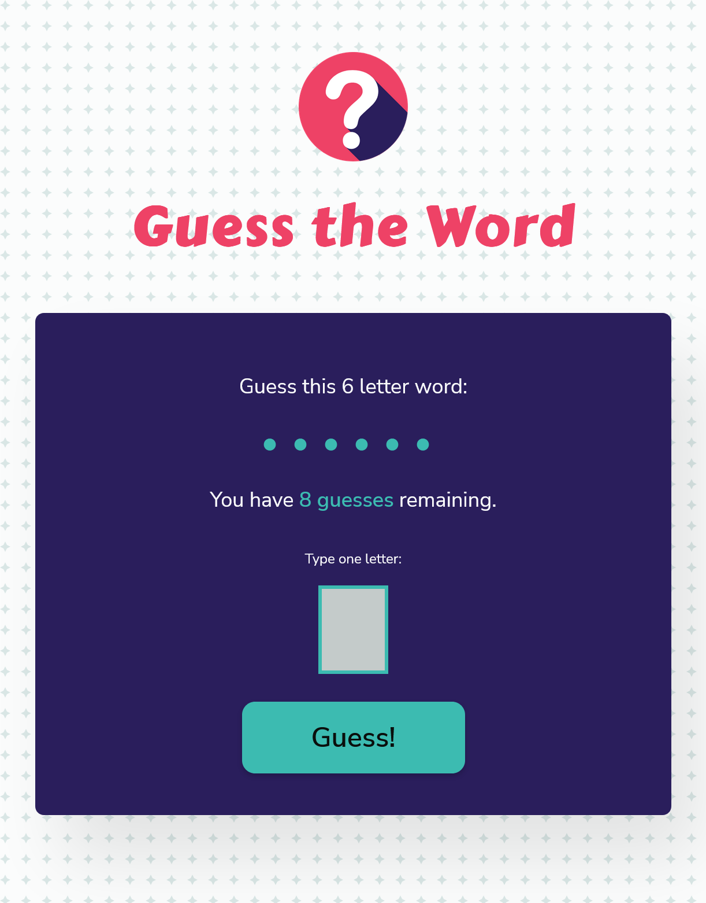

# Guess The Word Game

This is a revised version of The Guess the Word game project from the [Skillcrush](https://skillcrush.com) JavaScript Fundamentals course, with updated JavaScript functions, styling, and game messaging.  

## Table of contents

- [Overview](#overview)
  - [Screenshot](#screenshot)
  - [Links](#links)
  - [Game Mechanics](#game-mechanics)
- [My process](#my-process)
  - [Built with](#built-with)
  - [Future enhancements](#future-enhancements)

## Overview

### Screenshot

### Links

- Live Site URL: [Guess-the-word-2.0](https://guess-the-word-2022.vercel.app/)

### Game Mechanics

Users should be able to:

- Guess the answer to a secret word, chosen at random, by inputting one letter at a time
- Have a limited number of chances to guess the correct answer
- Start a new game after a win or loss

## My Process

### Built with 

- JavaScript
- HTML 5 / CSS
- Flexbox

### Future enhancements

- Score tracking
- Choose a difficulty setting

